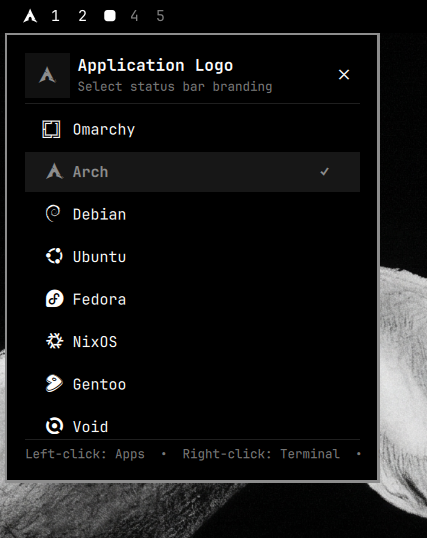

# OmaLogo 󰣇

An elegant, modern application menu launcher and distribution branding plugin for **[Omarchy](https://omarchy.org/)** (Arch Linux + Hyprland + Quickshell).

OmaLogo replaces the status bar logo button with an interactive, multi-purpose widget featuring **Niri-style workspace scrolling** and an embedded **Distribution Logo Picker** supporting 22 Linux and Unix distributions.

---

<p align="center">
  
</p>

---

## ⚡ Installation

To install and immediately enable OmaLogo on your Omarchy status bar:

```bash
omarchy plugin add https://github.com/thepathless/omalogo.git --enable
```

---

## 🔄 Update

To update OmaLogo to the latest release:

```bash
omarchy plugin update omalogo
```

---

## 🗑️ Removal / Uninstall

To safely remove OmaLogo from your status bar and system:

```bash
omarchy plugin remove omalogo
```

---

## ✨ Features

- **App Menu Launch**: Left-click to summon the native Omarchy application and command menu.
- **Terminal Shortcut**: Right-click to immediately launch the default terminal emulator (`xdg-terminal-exec`).
- **Distribution Branding**: Middle-click to choose from 22 distribution logos (Omarchy, Arch, Debian, Ubuntu, Fedora, NixOS, Gentoo, Void, Alpine, openSUSE, Manjaro, Mint, EndeavourOS, Pop!_OS, Kali, Artix, FreeBSD, Red Hat, Rocky, AlmaLinux, CentOS, Tux).
- **Workspace Scrolling**: Scroll up or down on the logo to navigate between active Hyprland workspaces forward and backward (Niri-style).
- **Clean Typography**: Dynamic tooltip showing the active distribution name (`Arch`, `Omarchy`, `Fedora`, `Tux`, etc.).
- **Zero-Drift State Persistence**: Your selected distribution logo is automatically persisted in `~/.config/omarchy/shell.json`.

---

## 🎮 Interactions

| Action | Function |
| :--- | :--- |
| **Left-Click** | Open Omarchy Application Menu |
| **Right-Click** | Launch Default Terminal |
| **Middle-Click** | Open Distribution Logo Picker |
| **Scroll Down** | Next Workspace (`hl.dsp.focus({ workspace = "e+1" })`) |
| **Scroll Up** | Previous Workspace (`hl.dsp.focus({ workspace = "e-1" })`) |

---

## 🛠️ Configuration

To manually position or configure OmaLogo in `~/.config/omarchy/shell.json`:

```json
{
  "bar": {
    "layout": {
      "left": [
        {
          "id": "omalogo",
          "distro": "arch"
        }
      ]
    }
  }
}
```

---

## 📄 License

MIT License. Designed with ❤️ for the [Omarchy](https://omarchy.org/) Linux desktop.

